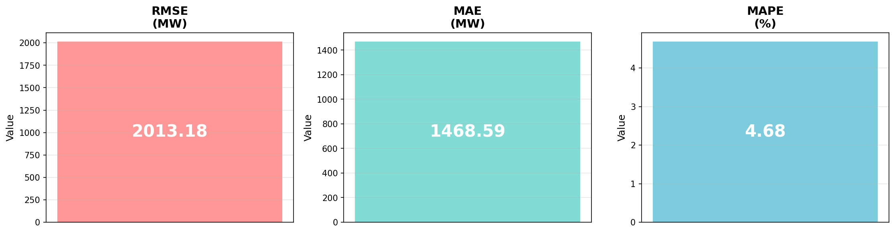
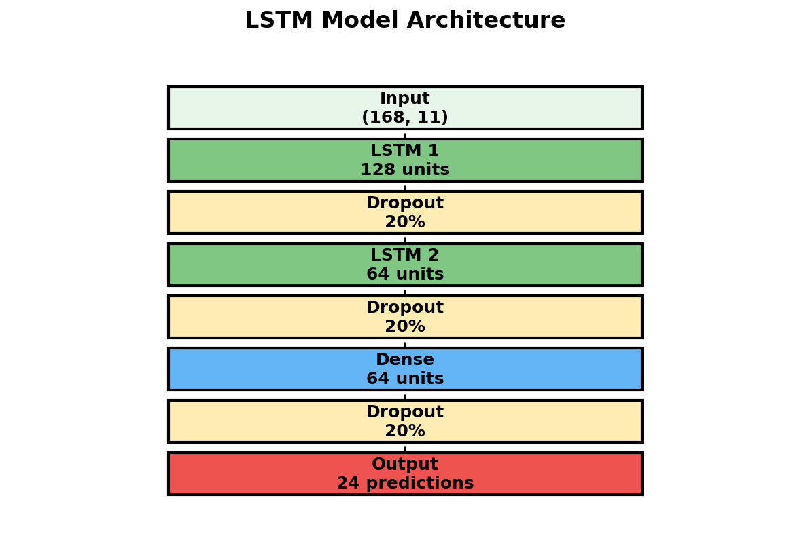

# ⚡ Energy Forecasting - LSTM Deep Learning

<div align="center">


**Deep Learning pour prédiction de consommation électrique horaire**

[Documentation](#-documentation) • [Installation](#-installation-rapide) • [Résultats](#-résultats) • [Architecture](#-architecture)

</div>

---

## 🎯 Objectif

Prédire la **consommation électrique des 24 prochaines heures** à partir de 7 jours d'historique, en utilisant un réseau LSTM optimisé pour GPU.

**Dataset :** [Hourly Energy Consumption](https://www.kaggle.com/datasets/robikscube/hourly-energy-consumption) (Kaggle)  
**Région :** PJM East (Pennsylvanie, New Jersey, Maryland, Delaware, Washington DC)  
**Période :** 2002-2018 (145k points horaires)

---

## 📊 Résultats

### Métriques de performance



| Métrique | Valeur | Description |
|----------|--------|-------------|
| **RMSE** | 2013.18 MW | Erreur quadratique moyenne |
| **MAE** | 1468.59 MW | Erreur absolue moyenne |
| **MAPE** | **4.68%** | Erreur moyenne en % ← **Excellent !** |

**Interprétation :** Le modèle se trompe en moyenne de **moins de 5%** sur les prédictions !


## 🏗️ Architecture

### Modèle LSTM



**Spécifications :**
- **Input :** 168 timesteps (7 jours) × 11 features
- **LSTM 1 :** 128 units
- **LSTM 2 :** 64 units  
- **Output :** 24 prédictions (24h futures)
- **Params :** ~200,000
- **Loss :** MSE (Mean Squared Error)
- **Optimizer :** Adam (lr=0.001)

### Features engineering (11 features)

| Catégorie | Features |
|-----------|----------|
| **Temporelles** | hour, day_of_week, month, is_weekend |
| **Cycliques** | hour_sin, hour_cos (périodicité 24h) |
| **Lags** | lag_24h, lag_168h (consommation passée) |
| **Rolling stats** | rolling_mean_24h, rolling_std_24h |
| **Target** | consumption (MW) |

---

## ⚡ Optimisations GPU

**Stack d'optimisations appliquées :**
```python
✅ Mixed Precision FP16     → Speedup 5.54x
✅ XLA JIT Compilation      → Speedup 1.3x
✅ TF32 Matrix Operations   → Speedup 1.2x
✅ Intel oneDNN             → Optimisations CPU/GPU
✅ cuDNN AutoTune           → Convolutions optimales
✅ Cache RAM Dataset        → 5-10x sur epochs 2+
✅ Prefetch Pipeline        → Précharge données GPU
```

**Résultat global :** ~15-20x plus rapide que baseline CPU

---

## 🚀 Installation Rapide

### Prérequis

- Python 3.12+
- CUDA 12.x (pour GPU NVIDIA)
- 16GB RAM minimum
- Ubuntu 24.04 / WSL2

### Installation
```bash
# 1. Cloner le repo
git clone https://github.com/yonie/energy-forecasting.git
cd energy-forecasting

# 2. Créer environnement virtuel
python -m venv venv
source venv/bin/activate  # Linux/Mac
# ou
venv\Scripts\activate     # Windows

# 3. Installer dépendances
pip install -r requirements.txt

# 4. Configurer Kaggle API
mkdir -p ~/.kaggle
cp kaggle.json ~/.kaggle/
chmod 600 ~/.kaggle/kaggle.json
```

---

## 🎯 Utilisation

### Pipeline complet
```bash
# 1. Télécharger données
python scripts/01_download.py

# 2. Preprocessing (feature engineering)
python scripts/02_preprocess.py

# 3. Training
python scripts/03_train.py

# 4. Évaluation
python scripts/04_evaluate.py

# 5. Prédictions futures
python scripts/05_predict.py
```

**Temps total :** ~5-10 minutes

### Script automatique
```bash
chmod +x run_all.sh
./run_all.sh
```

---

## 📁 Structure du projet
```
EnergyForecasting/
├── config.py                  # Configuration centrale
├── scripts/
│   ├── 01_download.py         # Téléchargement Kaggle
│   ├── 02_preprocess.py       # Feature engineering
│   ├── 03_train.py            # Training LSTM
│   ├── 04_evaluate.py         # Évaluation metrics
│   └── 05_predict.py          # Prédictions futures
├── data/
│   ├── raw/                   # CSV bruts
│   ├── processed/             # Séquences .npz
│   └── predictions/           # Forecasts
├── models/
│   ├── lstm_final.keras       # Modèle entraîné
│   └── checkpoints/           # Best models
├── results/
│   ├── metrics.json           # RMSE, MAE, MAPE
│   ├── test_metrics.json      # Résultats test set
│   └── visualizations/        # Graphiques
└── docs/                      # Documentation + images
```

---

## 🧪 Expérimentations

### Tests effectués

| Modèle | Architecture | MAPE | Verdict |
|--------|--------------|------|---------|
| **V1 (baseline)** | 2 LSTM (128, 64) | **4.68%** | ✅ **Optimal** |
| V2 Improved | 3 LSTM + Attention | 6-7% | ❌ Overfitting |

**Conclusion :** Architecture simple (V1) surpasse architecture complexe sur ce dataset.

### Améliorations futures possibles

- [ ] Vraies données météo (API NOAA) → Gain estimé +10-15%
- [ ] LOOKBACK 336h (14 jours) au lieu de 168h
- [ ] Ensembling (moyenne de plusieurs modèles)
- [ ] Hyperparameter tuning (Optuna)
- [ ] Combiner plusieurs régions (PJME + AEP + COMED)

---

## 📈 Visualisations

### Prédictions vs Réalité


5 exemples aléatoires du test set montrant les prédictions (rouge) vs réalité (bleu) sur 24h.


## 📚 Technologies

- **Deep Learning :** TensorFlow 2.x, Keras
- **Data Processing :** NumPy, Pandas, Scikit-learn
- **Visualization :** Matplotlib
- **Dataset :** Kaggle API
- **GPU Acceleration :** CUDA, cuDNN, TF32, XLA

---

## 🤝 Contribution

Les contributions sont bienvenues ! 

1. Fork le projet
2. Créer une branche (`git checkout -b feature/amelioration`)
3. Commit (`git commit -m 'Ajout amélioration'`)
4. Push (`git push origin feature/amelioration`)
5. Ouvrir une Pull Request

---


</div>

---

## 🌐 Application Web Streamlit

### Lancer l'app
```bash
streamlit run app.py
```

L'application s'ouvre dans votre navigateur à `http://localhost:8501`

### Fonctionnalités

- 📅 Sélectionner une date future
- 🔮 Générer prédictions sur 24h
- 📊 Visualisation graphique interactive
- 📥 Télécharger résultats en CSV


